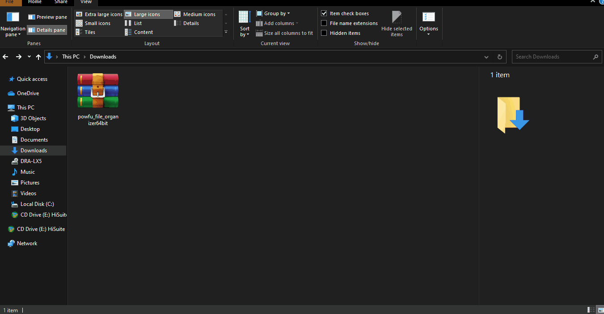
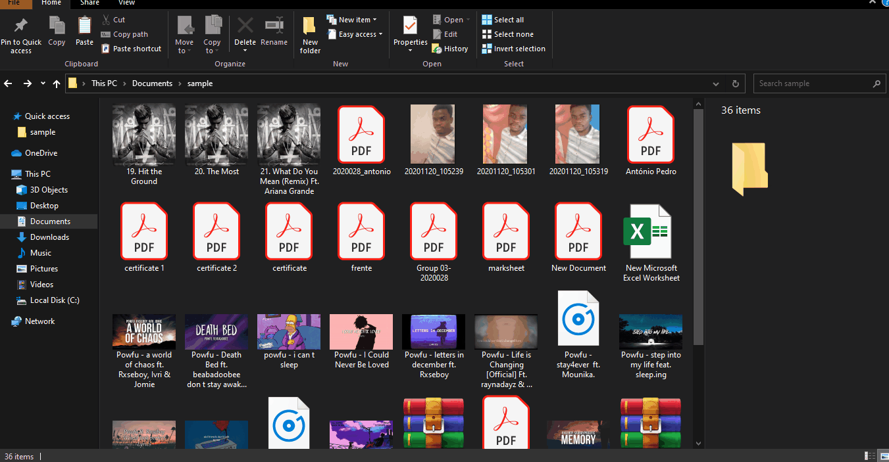

# powfu_file_organizer

    This is a utility script to help users organize their files easily.
    It goes through a folder and check all files and organize them by type (extension).

## Requirements:

- shutil: provides utilities (functions) for copying, archiving files and directory trees.
- os: it allows you to work with directories, files and so on.
- sys: This module provides access to some objects used or maintained by the interpreter and to functions that interact strongly with the interpreter.

> Link to download: <https://bit.ly/3ofs7fk>

## For a better explanation `READ_FIRST.txt`

```text
To Install:
  1. Open the setup
  2. Wait untill the installation be done.

How to use:
  1. Open the folder you want to organize.
  2. Click on the right button of your mouse (To open the Context Menu)
  3. Click on Organize With PowFu - File Organizer

To uninstall:
  1. Go to Program Files
  2. Open the uninstaller
  3. Restart your computer if required

This program was made by Antonio Pedro.

Follow me: 
github: github.com/antonio-pedro99
Facebook: Antonio Pedro
Instagram: @antonio.pedro42
```


## Demo

- `Installation`



- `How to use`



**Don't change or delete any file!** \
*You may contribute to this project if  you want, feel free to do that.*

---

&copy; [António Pedro](https://github.com/antonio-pedro99/)
